# SDLC neden gereklidir?

> **Kısaca:** SDLC (Software Development Life Cycle), yazılım geliştirme sürecine yapı, kontrol ve sürdürülebilirlik kazandırır.  
> Her adımın tanımlı olması, kaliteyi rastlantısal olmaktan çıkarır ve **ölçülebilir başarı** üretir.

---

## SDLC’nin temel katkıları

- **Kalite ve izlenebilirlik:** Gereksinimden canlıya kadar olan tüm adımlar kayıt altındadır. Her değişiklik geri izlenebilir.  
- **Verimlilik:** Tanımlı aşamalar, tekrar eden hataları ve gereksiz iş yükünü ortadan kaldırır.  
- **Risk yönetimi:** Test, kod inceleme ve kabul kriterleri gibi kontrollerle hatalar erken tespit edilir.  
- **Maliyet kontrolü:** Sorunlar üretimden önce fark edilir; bakım maliyetleri düşer.  
- **Standart uyumu:** ISO/IEC 12207, 25010 gibi süreç standartlarına doğal olarak yaklaşım sağlar.  
- **Ölçeklenebilirlik:** Yeni ekip üyeleri sürece kolayca adapte olur; bilgi kişilere bağlı kalmaz.

!!! success "Özet"
    **Tanımlı süreç + otomasyon + kalite ölçümü + dokümantasyon = öngörülebilir hız ve güvenilir sonuç.**

---

## SDLC neden zorunludur? (Derinlemesine açıklama)

> SDLC, karmaşık yazılım projelerini yönetilebilir hale getirir.  
> Kalite, hız, maliyet ve güvenlik hedeflerinin **aynı anda** sağlanmasını mümkün kılar.

### Süreç eksikliğinin sonuçları
- **Belirsiz kapsam:** Proje yönü sürekli değişir, teslim tarihleri kayar.  
- **Geç fark edilen hatalar:** Üretim ortamında yüksek maliyetli hatalar oluşur.  
- **Bilgi kaybı:** Dokümantasyon eksikliği nedeniyle bilgi bireylere bağımlı hale gelir.  
- **Tekrarlanan hatalar:** Öğrenme kültürü ve retrospektif eksikliğinde aynı sorunlar tekrar yaşanır.  
- **Artan maliyet:** Hatalar geç aşamada fark edildiğinde maliyet katlanarak artar.

!!! info "Defect Cost Eğrisi"
    Bir hatayı **gereksinim aşamasında** bulmak 1 birim maliyetse,  
    **testte** 10 birim, **canlı ortamda** ise 100 birime ulaşabilir.  
    SDLC’nin amacı hataları **erken, ucuz ve sistematik** biçimde yakalamaktır.

---

## Ölçülebilir başarı nasıl kanıtlanır?

| Boyut | İzlenecek metrik | Hedef | Etkisi |
|---|---|---:|---|
| Teslim süresi | Değişiklik başına lead time | ↓ | Süreç verimliliğini artırır |
| Yayın sıklığı | Release sayısı | ↑ | Otomasyon ve küçük sürümlerle hızlanır |
| Kalite | Kaçan hata oranı | ↓ | Test stratejisini iyileştirir |
| Güvenlik | Açık kapatma süresi | ↓ | Sürekli güvenlik taramalarıyla azalır |
| Kararlılık | Rollback oranı | ↓ | Dağıtım öncesi kontrollü testlerle düşer |
| Ekip deneyimi | Developer Experience/NPS | ↑ | Net süreçler ve düşük bilişsel yük sağlar |

---

## İzlenebilirlik (Traceability) Akışı

```mermaid
flowchart LR
    RQ["Requirement/User Story"] --> AC["Acceptance Criteria"]
    AC --> TS["Test Case&#39;ler"]
    TS --> TR["Test Raporu"]
    RQ --> BR["Branch/PR"]
    BR --> CI["CI Pipeline"]
    CI --> AR["Artifact (Build)"]
    AR --> DEP["Deployment"]
    TR --> REL["Release Notes"]
    REL --> MON["Monitoring/SLI"]
    MON --> PM["Postmortem & RCA"]
    PM -.-> RQ
```

