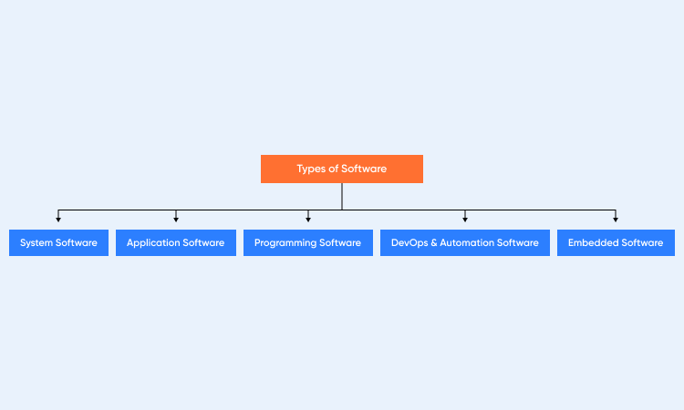
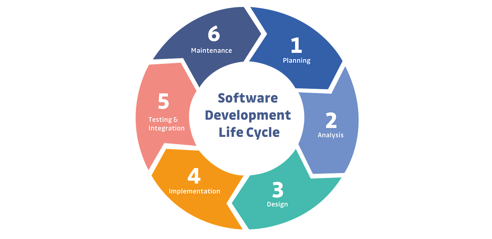
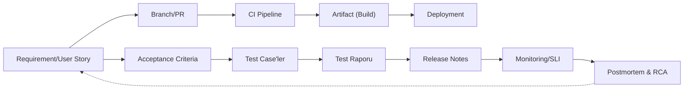

# Yazılım Sınıflandırması ve SDLC'nin Evrenselliği

Yazılım Geliştirme Yaşam Döngüsü (SDLC), geliştirdiğiniz yazılımın türünden bağımsız olarak kaliteyi, verimliliği ve öngörülebilirliği sağlamanın temel çerçevesidir. İster karmaşık bir işletim sistemi, ister basit bir mobil uygulama veya bir fabrika robotu için gömülü bir yazılım olsun, **hepsi tanımlı bir yaşam döngüsüne ihtiyaç duyar**.

Yazılım dünyası geniş bir yelpazeye yayılır. SDLC'yi neden uyguladığımızı daha iyi anlamak için önce "ne" geliştirdiğimize, yani temel yazılım sınıflandırmalarına bakalım.

## 1. Sistem Yazılımı (System Software)
Sistem yazılımı, bir bilgisayar sisteminin temel bileşenlerini yönetir. Donanımın ve diğer yazılımların uyum içinde çalışmasını sağlar. Bu yazılım dosya yönetimi, program yürütme ve sistem kaynak tahsisini gerçekleştirir. Her gün karşılaştığımız sistem yazılımı türlerini inceleyelim:

* **İşletim Sistemleri (OS):** Bilgisayarınızın en kritik yazılımıdır. CPU, RAM, sabit disk ve ekran gibi tüm donanım bileşenlerini yönetir. Ayrıca diğer yazılımların sorunsuz çalışmasını sağlar. Windows, macOS, Linux ve Android buna örnektir.
* **Aygıt Sürücüleri (Device Drivers):** Aygıt sürücüleri, donanımın işletim sistemiyle etkileşime girmesine yardımcı olan küçük programlardır. Örneğin, bir yazıcının bir yazıcı sürücüsüne, bir klavyenin bir klavye sürücüsüne ihtiyacı vardır. Her aygıt, bilgisayarla iletişim kurmak için kendi sürücüsüne güvenir.
* **Yardımcı Yazılımlar (Utility Software):** Yardımcı yazılımlar bilgisayarınızı iyi durumda tutar. Virüs taraması, gereksiz dosya temizleme ve yedekleme yönetimi gibi görevleri etkiler. Antivirüs programları, disk temizleme araçları ve WinZip gibi dosya sıkıştırıcılar buna örnektir.

## 2. Uygulama Yazılımı (Application Software)
Uygulama yazılımı, yazma, çizim yapma, çalışma veya oyun oynama gibi belirli işleri yapmak için tasarlanmıştır. Ana odağı son kullanıcılardır. Her gün kullandığımız uygulama yazılımı türlerini keşfedelim:

* **Verimlilik Yazılımları (Productivity Software):** Bunlar, işi hızlandırmak için yapılmış araçlardır. Kelime işlemciler, hesap tabloları ve sunum araçları – bunlar içerik oluşturmanıza ve yönetmenize yardımcı olur. Microsoft Office, Google Workspace veya Notion'ı düşünün.
* **Multimedya Yazılımları (Multimedia Software):** Multimedya araçları ses, video, grafik ve animasyonlarla ilgilenir. Adobe Photoshop veya VLC Media Player gibi uygulamalar bu gruba girer. DevOps ekipleri, süreçleri kaydetmek ve eğitim modülleri oluşturmak için multimedya yazılımlarını kullanır.
* **Web Tarayıcıları (Web Browsers):** Web tarayıcıları dijital kapılardır. Kullanıcıların web sitelerine ve çevrimiçi platformlara erişmesini sağlar. Örnekler arasında Chrome, Firefox ve Safari bulunur. Jenkins Arayüzü ve Grafana panelleri gibi web tabanlı DevOps gösterge tablolarını çalıştırırlar.
* **İletişim Yazılımları (Communication Software):** Bu uygulamalar ekiplerin bağlantıda kalmasını sağlar. Zoom, Slack ve Microsoft Teams gibi araçlar anlık mesajlaşma, görüntülü arama ve ekip çalışmasına yardımcı olur. Çevik ve DevOps iş akışlarında, bu araçlar sprint'ler sırasında sorunsuz iletişim için çok önemlidir.

## 3. Programlama Yazılımı (Programming Software)
Programlama yazılımı, kodlayıcıların program yazmasına ve test etmesine olanak tanır. Diğer yazılımları oluşturmak için kullanılır.

* **Kod Düzenleyiciler (Code Editors):** Kod düzenleyiciler, kaynak kodu yazmak için kullanılan temel metin ortamlarıdır. Örnekler arasında Notepad++, Sublime Text ve Visual Studio Code bulunur. DevOps'ta, VS Code eklentileri Docker, YAML, GitOps ve Terraform betiklerini destekler.
* **Derleyiciler ve Yorumlayıcılar (Compilers and Interpreters):** Bu araçlar, insanlar tarafından yazılan kodu makinelerin anlayabileceği bir dile dönüştürür. Derleyiciler tüm programları bir kerede işlerken, yorumlayıcılar satır satır çalıştırır. Python ve Java gibi dillerin çalışması için bunlara ihtiyaç vardır.
* **Hata Ayıklayıcılar (Debuggers):** Hata ayıklayıcılar, koddaki hataları (bug) bulmaya ve düzeltmeye yardımcı olur. Hataları takip eder, loglara bakar ve kodun nasıl çalıştığını test eder. DevOps ekipleri, pipeline'larında Sürekli Test (Continuous Testing) sırasında sıkça hata ayıklama araçları kullanır.

## 4. DevOps ve Otomasyon Yazılımı (DevOps & Automation Software)
DevOps yazılımı, geliştirme (development) ve operasyon (operations) ekiplerini bir araya getirir. Süreçleri otomatik hale getirir, araçları birbirine bağlar ve dağıtım (deployment) karmaşasını azaltır.

* **Yapılandırma Yönetim Araçları (Configuration Management Tools):** Bu araçlar altyapı yönetimini ve kontrolünü etkiler. Ansible, Puppet ve Chef bazı örneklerdir. Sunucu senkronizasyonunu sürdürür, işletim sistemi güncellemelerini otomatik hale getirir ve farklı ortamlar arasında tutarlılığı garanti eder.
* **CI/CD Araçları:** Jenkins, GitLab CI ve CircleCI gibi CI/CD araçları derleme (build), test etme ve dağıtma (deployment) döngülerini otomatikleştirir. Ekiplerin kodu üretime sorunsuz bir şekilde göndermesine yardımcı olurlar.
* **Konteynerleştirme ve Orkestrasyon Araçları (Containerization and Orchestration Tools):** Docker ve Kubernetes, uygulamaları konteynerlerde çalıştırır ve nasıl büyüyeceklerini koordine eder. Kubernetes, bir küme (cluster) ortamında yük dengeleme (load balancing), pod ölçeklendirme ve sürüm stratejilerini (rollout) otomatikleştirir.
* **İzleme ve Uyarı Araçları (Monitoring and Alerting Tools):** Prometheus, Datadog ve New Relic gibi yazılımlar sistem sağlığını ve performansını gözlemler. Bir şey bozulursa veya iyi çalışmazsa kullanıcıları anında uyarır.

## 5. Gömülü Yazılım (Embedded Software)
Gömülü yazılım, bilgisayar olarak düşünmediğimiz makinelerde çalışır. Onu IoT cihazlarında, tıbbi cihazlarda ve fabrika robotlarında bulabilirsiniz. Önceden yüklenmiş olarak gelir, küçük denetleyicilerle çalışır ve işleri gerçek zamanlı olarak yapar.

* **Bellenim (Firmware):** Bellenim, donanım yongalarında saklanan özel bir tür gömülü koddur. Cihazın başlamasına ve diğer yazılım katmanlarıyla konuşmasına yardımcı olur. Yönlendiricinizi (router), çamaşır makinenizi veya akıllı termostatınızı düşünün.
* **Gerçek Zamanlı İşletim Sistemleri (RTOS):** RTOS, kalp pilleri veya araba fren sistemleri gibi zaman açısından kritik sistemlerdeki görevleri yönetir. Komutları minimum gecikme ve en yüksek doğrulukla işler.

## 6. Açık Kaynak vs. Tescilli Yazılım (Open Source vs Proprietary Software)
Bu grup, yazılıma kimin sahip olduğuna ve kimin erişebileceğine bakar.

* **Açık Kaynak Yazılım (Open Source Software):** Açık Kaynak araçlar herkesin kullanması, değiştirmesi ve iyileştirmesine yardımcı olması için ücretsizdir. Linux, Apache ve Git bazı örneklerdir. DevOps, esnek oldukları, nasıl çalıştıkları konusunda şeffaf oldukları ve çok sayıda eklentiye sahip oldukları için açık kaynak platformlarla iyi çalışır.
* **Tescilli Yazılım (Proprietary Software):** Tescilli araçlar şirketlere aittir. Kullanmak için bir lisans satın almanız gerekir. Windows OS ve Adobe Creative Suite örneklerdir. Genellikle özel destek ve ekstra özelliklerle birlikte gelirler.

## Sonuç: Her Yazılım Türü SDLC'ye İhtiyaç Duyar

Yazılım, günümüzde kullandığımız her dijital sistemin merkezindedir ve gördüğümüz gibi birçok farklı amaca hizmet eder.

Sonuç olarak, bu sınıflandırmaların **hepsi**, karmaşıklığı ne olursa olsun, bir **Yazılım Geliştirme Yaşam Döngüsü (SDLC)** gerektirir. İster bir Windows aygıt sürücüsü (Sistem Yazılımı), ister bir Django web sitesi (Uygulama Yazılımı), ister bir fabrikayı çalıştıran bir RTOS (Gömülü Yazılım) olsun; hepsinin planlanması, tasarlanması, geliştirilmesi, test edilmesi, dağıtılması ve bakımı gerekir.

Bu kılavuzun geri kalanı, bu evrensel SDLC sürecini nasıl yöneteceğimizi detaylandırmaktadır.

---

# SDLC neden gereklidir?

> **Kısaca:** SDLC (Software Development Life Cycle), yazılım geliştirme sürecine yapı, kontrol ve sürdürülebilirlik kazandırır.  
> Her adımın tanımlı olması, kaliteyi rastlantısal olmaktan çıkarır ve **ölçülebilir başarı** üretir.

---

## SDLC’nin temel katkıları

- **Kalite ve izlenebilirlik:** Gereksinimden canlıya kadar olan tüm adımlar kayıt altındadır. Her değişiklik geri izlenebilir. 
- **Verimlilik:** Tanımlı aşamalar, tekrar eden hataları ve gereksiz iş yükünü ortadan kaldırır. 
- **Risk yönetimi:** Test, kod inceleme ve kabul kriterleri gibi kontrollerle hatalar erken tespit edilir. 
- **Maliyet kontrolü:** Sorunlar üretimden önce fark edilir; bakım maliyetleri düşer. 
- **Standart uyumu:** ISO/IEC 12207, 25010 gibi süreç standartlarına doğal olarak yaklaşım sağlar. 
- **Ölçeklenebilirlik:** Yeni ekip üyeleri sürece kolayca adapte olur; bilgi kişilere bağlı kalmaz.

!!! success "Özet"
    **Tanımlı süreç + otomasyon + kalite ölçümü + dokümantasyon = öngörülebilir hız ve güvenilir sonuç.**

---

## SDLC neden zorunludur? (Derinlemesine açıklama)

> SDLC, karmaşık yazılım projelerini yönetilebilir hale getirir. 
> Kalite, hız, maliyet ve güvenlik hedeflerinin **aynı anda** sağlanmasını mümkün kılar.

### Süreç eksikliğinin sonuçları
- **Belirsiz kapsam:** Proje yönü sürekli değişir, teslim tarihleri kayar. 
- **Geç fark edilen hatalar:** Üretim ortamında yüksek maliyetli hatalar oluşur. 
- **Bilgi kaybı:** Dokümantasyon eksikliği nedeniyle bilgi bireylere bağımlı hale gelir. 
- **Tekrarlanan hatalar:** Öğrenme kültürü ve retrospektif eksikliğinde aynı sorunlar tekrar yaşanır. 
- **Artan maliyet:** Hatalar geç aşamada fark edildiğinde maliyet katlanarak artar.

!!! info "Defect Cost Eğrisi"
    Bir hatayı **gereksinim aşamasında** bulmak 1 birim maliyetse, 
    **testte** 10 birim, **canlı ortamda** ise 100 birime ulaşabilir. 
    SDLC’nin amacı hataları **erken, ucuz ve sistematik** biçimde yakalamaktır.

---

## Ölçülebilir başarı nasıl kanıtlanır?

| Boyut | İzlenecek metrik | Hedef | Etkisi |
|---|---|---:|---|
| Teslim süresi | Değişiklik başına lead time | ↓ | Süreç verimliliğini artırır |
| Yayın sıklığı | Release sayısı | ↑ | Otomasyon ve küçük sürümlerle hızlanır |
| Kalite | Kaçan hata oranı | ↓ | Test stratejisini iyileştirir |
| Güvenlik | Açık kapatma süresi | ↓ | Sürekli güvenlik taramalarıyla azalır |
| Kararlılık | Rollback oranı | ↓ | Dağıtım öncesi kontrollü testlerle düşer |
| Ekip deneyimi | Developer Experience/NPS | ↑ | Net süreçler ve düşük bilişsellik yük sağlar |

---

## İzlenebilirlik (Traceability) Akışı

