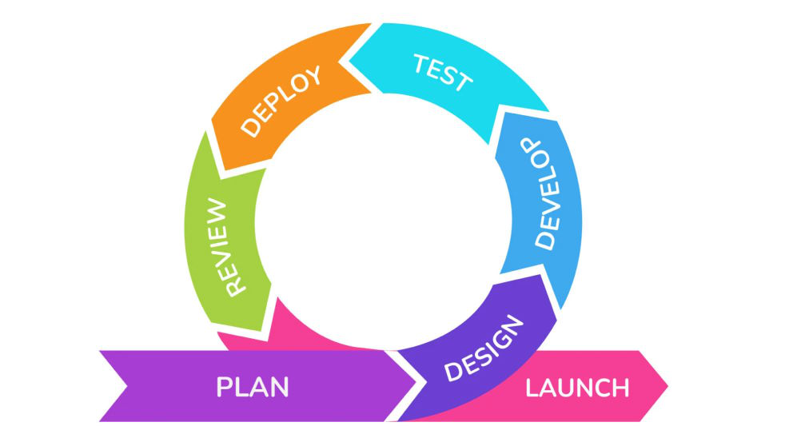

# Yazılım Sınıflandırması ve SDLC'nin Evrenselliği

Yazılım Geliştirme Yaşam Döngüsü (SDLC), geliştirdiğiniz yazılımın türünden bağımsız olarak kaliteyi, verimliliği ve öngörülebilirliği sağlamanın temel çerçevesidir. İster karmaşık bir işletim sistemi, ister basit bir mobil uygulama veya bir fabrika robotu için gömülü bir yazılım olsun, **hepsi tanımlı bir yaşam döngüsüne ihtiyaç duyar**.

Yazılım dünyası geniş bir yelpazeye yayılır. SDLC'yi neden uyguladığımızı daha iyi anlamak için önce "ne" geliştirdiğimize, yani temel yazılım sınıflandırmalarına bakalım.

## 1. Sistem Yazılımı (System Software)
Sistem yazılımı, bir bilgisayar sisteminin temel bileşenlerini yönetir. Donanımın ve diğer yazılımların uyum içinde çalışmasını sağlar. Bu yazılım dosya yönetimi, program yürütme ve sistem kaynak tahsisini gerçekleştirir. Her gün karşılaştığımız sistem yazılımı türlerini inceleyelim:

* **İşletim Sistemleri (OS):** Bilgisayarınızın en kritik yazılımıdır. CPU, RAM, sabit disk ve ekran gibi tüm donanım bileşenlerini yönetir. Ayrıca diğer yazılımların sorunsuz çalışmasını sağlar. Windows, macOS, Linux ve Android buna örnektir.
* **Aygıt Sürücüleri (Device Drivers):** Aygıt sürücüleri, donanımın işletim sistemiyle etkileşime girmesine yardımcı olan küçük programlardır. Örneğin, bir yazıcının bir yazıcı sürücüsüne, bir klavyenin bir klavye sürücüsüne ihtiyacı vardır. Her aygıt, bilgisayarla iletişim kurmak için kendi sürücüsüne güvenir.
* **Yardımcı Yazılımlar (Utility Software):** Yardımcı yazılımlar bilgisayarınızı iyi durumda tutar. Virüs taraması, gereksiz dosya temizleme ve yedekleme yönetimi gibi görevleri etkiler. Antivirüs programları, disk temizleme araçları ve WinZip gibi dosya sıkıştırıcılar buna örnektir.

## 2. Uygulama Yazılımı (Application Software)
Uygulama yazılımı, yazma, çizim yapma, çalışma veya oyun oynama gibi belirli işleri yapmak için tasarlanmıştır. Ana odağı son kullanıcılardır. Her gün kullandığımız uygulama yazılımı türlerini keşfedelim:

* **Verimlilik Yazılımları (Productivity Software):** Bunlar, işi hızlandırmak için yapılmış araçlardır. Kelime işlemciler, hesap tabloları ve sunum araçları – bunlar içerik oluşturmanıza ve yönetmenize yardımcı olur. Microsoft Office, Google Workspace veya Notion'ı düşünün.
* **Multimedya Yazılımları (Multimedia Software):** Multimedya araçları ses, video, grafik ve animasyonlarla ilgilenir. Adobe Photoshop veya VLC Media Player gibi uygulamalar bu gruba girer. DevOps ekipleri, süreçleri kaydetmek ve eğitim modülleri oluşturmak için multimedya yazılımlarını kullanır.
* **Web Tarayıcıları (Web Browsers):** Web tarayıcıları dijital kapılardır. Kullanıcıların web sitelerine ve çevrimiçi platformlara erişmesini sağlar. Örnekler arasında Chrome, Firefox ve Safari bulunur. Jenkins Arayüzü ve Grafana panelleri gibi web tabanlı DevOps gösterge tablolarını çalıştırırlar.
* **İletişim Yazılımları (Communication Software):** Bu uygulamalar ekiplerin bağlantıda kalmasını sağlar. Zoom, Slack ve Microsoft Teams gibi araçlar anlık mesajlaşma, görüntülü arama ve ekip çalışmasına yardımcı olur. Çevik ve DevOps iş akışlarında, bu araçlar sprint'ler sırasında sorunsuz iletişim için çok önemlidir.

## 3. Programlama Yazılımı (Programming Software)
Programlama yazılımı, kodlayıcıların program yazmasına ve test etmesine olanak tanır. Diğer yazılımları oluşturmak için kullanılır.

* **Kod Düzenleyiciler (Code Editors):** Kod düzenleyiciler, kaynak kodu yazmak için kullanılan temel metin ortamlarıdır. Örnekler arasında Notepad++, Sublime Text ve Visual Studio Code bulunur. DevOps'ta, VS Code eklentileri Docker, YAML, GitOps ve Terraform betiklerini destekler.
* **Derleyiciler ve Yorumlayıcılar (Compilers and Interpreters):** Bu araçlar, insanlar tarafından yazılan kodu makinelerin anlayabileceği bir dile dönüştürür. Derleyiciler tüm programları bir kerede işlerken, yorumlayıcılar satır satır çalıştırır. Python ve Java gibi dillerin çalışması için bunlara ihtiyaç vardır.
* **Hata Ayıklayıcılar (Debuggers):** Hata ayıklayıcılar, koddaki hataları (bug) bulmaya ve düzeltmeye yardımcı olur. Hataları takip eder, loglara bakar ve kodun nasıl çalıştığını test eder. DevOps ekipleri, pipeline'larında Sürekli Test (Continuous Testing) sırasında sıkça hata ayıklama araçları kullanır.

## 4. DevOps ve Otomasyon Yazılımı (DevOps & Automation Software)
DevOps yazılımı, geliştirme (development) ve operasyon (operations) ekiplerini bir araya getirir. Süreçleri otomatik hale getirir, araçları birbirine bağlar ve dağıtım (deployment) karmaşasını azaltır.

* **Yapılandırma Yönetim Araçları (Configuration Management Tools):** Bu araçlar altyapı yönetimini ve kontrolünü etkiler. Ansible, Puppet ve Chef bazı örneklerdir. Sunucu senkronizasyonunu sürdürür, işletim sistemi güncellemelerini otomatik hale getirir ve farklı ortamlar arasında tutarlılığı garanti eder.
* **CI/CD Araçları:** Jenkins, GitLab CI ve CircleCI gibi CI/CD araçları derleme (build), test etme ve dağıtma (deployment) döngülerini otomatikleştirir. Ekiplerin kodu üretime sorunsuz bir şekilde göndermesine yardımcı olurlar.
* **Konteynerleştirme ve Orkestrasyon Araçları (Containerization and Orchestration Tools):** Docker ve Kubernetes, uygulamaları konteynerlerde çalıştırır ve nasıl büyüyeceklerini koordine eder. Kubernetes, bir küme (cluster) ortamında yük dengeleme (load balancing), pod ölçeklendirme ve sürüm stratejilerini (rollout) otomatikleştirir.
* **İzleme ve Uyarı Araçları (Monitoring and Alerting Tools):** Prometheus, Datadog ve New Relic gibi yazılımlar sistem sağlığını ve performansını gözlemler. Bir şey bozulursa veya iyi çalışmazsa kullanıcıları anında uyarır.

## 5. Gömülü Yazılım (Embedded Software)
Gömülü yazılım, bilgisayar olarak düşünmediğimiz makinelerde çalışır. Onu IoT cihazlarında, tıbbi cihazlarda ve fabrika robotlarında bulabilirsiniz. Önceden yüklenmiş olarak gelir, küçük denetleyicilerle çalışır ve işleri gerçek zamanlı olarak yapar.

* **Bellenim (Firmware):** Bellenim, donanım yongalarında saklanan özel bir tür gömülü koddur. Cihazın başlamasına ve diğer yazılım katmanlarıyla konuşmasına yardımcı olur. Yönlendiricinizi (router), çamaşır makinenizi veya akıllı termostatınızı düşünün.
* **Gerçek Zamanlı İşletim Sistemleri (RTOS):** RTOS, kalp pilleri veya araba fren sistemleri gibi zaman açısından kritik sistemlerdeki görevleri yönetir. Komutları minimum gecikme ve en yüksek doğrulukla işler.

## 6. Açık Kaynak vs. Tescilli Yazılım (Open Source vs Proprietary Software)
Bu grup, yazılıma kimin sahip olduğuna ve kimin erişebileceğine bakar.

* **Açık Kaynak Yazılım (Open Source Software):** Açık Kaynak araçlar herkesin kullanması, değiştirmesi ve iyileştirmesine yardımcı olması için ücretsizdir. Linux, Apache ve Git bazı örneklerdir. DevOps, esnek oldukları, nasıl çalıştıkları konusunda şeffaf oldukları ve çok sayıda eklentiye sahip oldukları için açık kaynak platformlarla iyi çalışır.
* **Tescilli Yazılım (Proprietary Software):** Tescilli araçlar şirketlere aittir. Kullanmak için bir lisans satın almanız gerekir. Windows OS ve Adobe Creative Suite örneklerdir. Genellikle özel destek ve ekstra özelliklerle birlikte gelirler.

## Sonuç: Her Yazılım Türü SDLC'ye İhtiyaç Duyar

Yazılım, günümüzde kullandığımız her dijital sistemin merkezindedir ve gördüğümüz gibi birçok farklı amaca hizmet eder.

Sonuç olarak, bu sınıflandırmaların **hepsi**, karmaşıklığı ne olursa olsun, bir **Yazılım Geliştirme Yaşam Döngüsü (SDLC)** gerektirir. İster bir Windows aygıt sürücüsü (Sistem Yazılımı), ister bir Django web sitesi (Uygulama Yazılımı), ister bir fabrikayı çalıştıran bir RTOS (Gömülü Yazılım) olsun; hepsinin planlanması, tasarlanması, geliştirilmesi, test edilmesi, dağıtılması ve bakımı gerekir.

Bu kılguzun geri kalanı, bu evrensel SDLC sürecini nasıl yöneteceğimizi detaylandırmaktadır.

---

# SDLC neden gereklidir?

> **Kısaca:** SDLC (Software Development Life Cycle), yazılım geliştirme sürecine yapı, kontrol ve sürdürülebilirlik kazandırır.  
> Her adımın tanımlı olması, kaliteyi rastlantısal olmaktan çıkarır ve **ölçülebilir başarı** üretir.

---

## SDLC’nin temel katkıları

- **Kalite ve izlenebilirlik:** Gereksinimden canlıya kadar olan tüm adımlar kayıt altındadır. Her değişiklik geri izlenebilir. 
- **Verimlilik:** Tanımlı aşamalar, tekrar eden hataları ve gereksiz iş yükünü ortadan kaldırır. 
- **Risk yönetimi:** Test, kod inceleme ve kabul kriterleri gibi kontrollerle hatalar erken tespit edilir. 
- **Maliyet kontrolü:** Sorunlar üretimden önce fark edilir; bakım maliyetleri düşer. 
- **Standart uyumu:** ISO/IEC 12207, 25010 gibi süreç standartlarına doğal olarak yaklaşım sağlar. 
- **Ölçeklenebilirlik:** Yeni ekip üyeleri sürece kolayca adapte olur; bilgi kişilere bağlı kalmaz.

> **Özet**
>
> **Tanımlı süreç + otomasyon + kalite ölçümü + dokümantasyon = öngörülebilir hız ve güvenilir sonuç.**

---

## SDLC neden zorunludur? (Derinlemesine açıklama)

> SDLC, karmaşık yazılım projelerini yönetilebilir hale getirir. 
> Kalite, hız, maliyet ve güvenlik hedeflerinin **aynı anda** sağlanmasını mümkün kılar.

### Süreç eksikliğinin sonuçları
- **Belirsiz kapsam:** Proje yönü sürekli değişir, teslim tarihleri kayar. 
- **Geç fark edilen hatalar:** Üretim ortamında yüksek maliyetli hatalar oluşur. 
- **Bilgi kaybı:** Dokümantasyon eksikliği nedeniyle bilgi bireylere bağımlı hale gelir. 
- **Tekrarlanan hatalar:** Öğrenme kültürü ve retrospektif eksikliğinde aynı sorunlar tekrar yaşanır. 
- **Artan maliyet:** Hatalar geç aşamada fark edildiğinde maliyet katlanarak artar.

> **Defect Cost Eğrisi**
>
> Bir hatayı **gereksinim aşamasında** bulmak 1 birim maliyetse, 
> **testte** 10 birim, **canlı ortamda** ise 100 birime ulaşabilir. 
> SDLC’nin amacı hataları **erken, ucuz ve sistematik** biçimde yakalamaktır.

---

## Ölçülebilir başarı nasıl kanıtlanır?

| Boyut | İzlenecek metrik | Hedef | Etkisi |
|---|---|---:|---|
| Teslim süresi | Değişiklik başına lead time | ↓ | Süreç verimliliğini artırır |
| Yayın sıklığı | Release sayısı | ↑ | Otomasyon ve küçük sürümlerle hızlanır |
| Kalite | Kaçan hata oranı | ↓ | Test stratejisini iyileştirir |
| Güvenlik | Açık kapatma süresi | ↓ | Sürekli güvenlik taramalarıyla azalır |
| Kararlılık | Rollback oranı | ↓ | Dağıtım öncesi kontrollü testlerle düşer |
| Ekip deneyimi | Developer Experience/NPS | ↑ | Net süreçler ve düşük bilişsellik yük sağlar |

---

## İzlenebilirlik (Traceability) Akışı

---

# SDLC Modelleri: Projeniz İçin Doğru Yaklaşımı Seçmek

SDLC'nin *neden* zorunlu olduğunu ve kalite, verimlilik, maliyet gibi temel hedefleri nasıl güvence altına aldığını anladık. Ancak, her proje aynı değildir. Bir **Gömülü Yazılım (Embedded Software)** projesinin risk profili ile bir **Uygulama Yazılımı (Application Software)** projesinin esneklik ihtiyacı farklıdır.

Bu nedenle, SDLC'yi uygulamak için yıllar içinde farklı modeller (yaklaşımlar) geliştirilmiştir. Doğru modeli seçmek, projenizin başarısını doğrudan etkiler. İşte en yaygın SDLC modelleri, nasıl uygulandıkları ve hangi projeler için uygun oldukları.

## 1. Waterfall Model (Şelale Modeli)

En geleneksel ve katı modeldir. Adını, bir şelalenin suyu gibi, sürecin geri dönülmez bir şekilde (veya çok zor) bir sonraki aşamaya akmasından alır.

* **Nedir?**
    Katı, doğrusal ve sıralı bir modeldir. Bir aşama tamamen bitmeden bir sonraki aşamaya geçilemez. Geliştirme süreci, baştan sona tek bir büyük döngü olarak planlanır.
* **Nasıl Uygulanır?**
    Süreç, keskin sınırlarla ayrılmış şu fazlardan oluşur:
    1.  **Gereksinimler (Requirements):** Projeden *tüm* beklentiler en başta toplanır, analiz edilir ve dondurulur.
    2.  **Tasarım (Design):** Sistem mimarisi, veri tabanı yapısı ve arayüzler bu aşamada tasarlanır.
    3.  **Uygulama (Implementation):** Kodlama bu aşamada yapılır.
    4.  **Test (Testing/Verification):** Yazılım, gereksinimlere uygunluğu açısından *tüm proje bittikten sonra* test edilir.
    5.  **Dağıtım (Deployment):** Yazılım müşteriye teslim edilir veya canlı ortama kurulur.
    6.  **Bakım (Maintenance):** Canlıdaki hatalar düzeltilir veya küçük iyileştirmeler yapılır.
* **Avantajları:**
    * Yönetimi ve anlaşılması basittir.
    * Her aşamanın net çıktıları (deliverables) ve kilometre taşları (milestones) vardır.
    * Dokümantasyon çok güçlüdür.
* **Dezavantajları:**
    * Değişikliğe kesinlikle kapalıdır. Gereksinimlerdeki en ufak bir değişiklik bile tüm süreci başa döndürebilir.
    * Test aşaması en sonda olduğu için, hatalar çok geç ve yüksek maliyetle bulunur (Bkz. Defect Cost Eğrisi).
    * Projenin çalışan bir sürümünü görmek için aylar, hatta yıllar gerekebilir.
* **Ne Zaman Kullanılır?**
    Gereksinimlerin %100 net olduğu, *hiç değişmeyeceğinden* emin olunan projelerde kullanılır. Günümüzün dinamik yazılım dünyasında nadiren tercih edilir. (Örn: Basit bir donanım sürücüsü, askeri projeler).
    

## 2. V-Model (V Modeli - Doğrulama ve Geçerlilik Modeli)

V-Modeli, Waterfall'un test sorununa bir çözüm olarak doğmuştur. Test faaliyetlerini sürecin en başına entegre eder.

* **Nedir?**
    Waterfall modelinin bir uzantısıdır. Her geliştirme aşamasına karşılık, o aşamanın çıktılarını kontrol edecek bir test (Doğrulama ve Geçerlilik - Verification & Validation) aşaması planlanır.
* **Nasıl Uygulanır?**
    Model 'V' harfi şeklindedir. Sol taraf geliştirme (iniş), sağ taraf test (çıkış) aşamalarını temsil eder:
    * **Sol Taraf (Geliştirme):**
        1.  Gereksinim Analizi (Karşılığı: Kabul Testleri Planlanır)
        2.  Sistem Tasarımı (Karşılığı: Sistem Testleri Planlanır)
        3.  Mimari Tasarım (Karşılığı: Entegrasyon Testleri Planlanır)
        4.  Modül Tasarımı (Karşılığı: Birim Testler Planlanır)
    * **Alt Taraf (Kodlama):**
        5.  Kodlama (Implementation)
    * **Sağ Taraf (Test):**
        6.  Birim Testleri (Modül Tasarımını doğrular)
        7.  Entegrasyon Testleri (Mimari Tasarımı doğrular)
        8.  Sistem Testleri (Sistem Tasarımını doğrular)
        9.  Kabul Testleri (Gereksinimleri doğrular)
* **Avantajları:**
    * Test planlaması en başından başlar.
    * Hataların erken yakalanma olasılığı Waterfall'a göre çok daha yüksektir.
    * Kalite güvencesine (QA) odaklanır.
* **Dezavantajları:**
    * Waterfall gibi katıdır (rijittir) ve değişiklik yönetimi zordur.
    * Hala çalışan bir ürünü görmek için sürecin sonunu beklemek gerekir.
* **Ne Zaman Kullanılır?**
    Hatanın maliyetinin felaketle sonuçlanabileceği, güvenliğin kritik olduğu projelerde. Metninizde bahsettiğiniz **Gömülü Yazılımlar (Embedded Software)**, tıbbi cihazlar, otomotiv (ECU yazılımları), havacılık ve savunma sanayi projeleri için idealdir.

## 3. Iterative Model (Yinelemeli Model)

Bu model, "dev bir proje yapmak yerine, küçük parçalarla başlayıp, her seferinde büyüterek ilerleyelim" fikrine dayanır.

* **Nedir?**
    Proje, "yineleme" (iteration) adı verilen küçük döngülere bölünür. Her yinelemede, yazılımın bir önceki sürümüne yeni özellikler eklenir ve çalışan bir sürüm üretilir.
* **Nasıl Uygulanır?**
    1.  **Başlangıç Planlaması:** Temel gereksinimler ve mimari belirlenir.
    2.  **Yineleme 1:** En temel özellikler (çekirdek fonksiyonlar) planlanır, tasarlanır, kodlanır, test edilir ve (genellikle dahili olarak) yayınlanır.
    3.  **Yineleme 2:** İlk sürümden alınan geri bildirimler ve yeni özellikler planlanır, tasarlanır, kodlanır, test edilir ve yayınlanır.
    4.  **...ve devamı:** Yazılım, her döngüde daha da zenginleşerek son halini alır.
* **Avantajları:**
    * Projenin çalışan bir prototipi çok erken aşamalarda elde edilir.
    * Geri bildirim (feedback) döngüsü sayesinde riskler erken yönetilir.
    * Müşteri, süreci daha yakından takip edebilir.
* **Dezavantajları:**
    * Başlangıçta net bir mimari kurulmazsa, sistem ileride "yama" gibi büyüyebilir (teknik borç).
    * Kapsam kayması (scope creep) riski yüksektir; sürekli yeni özellik talepleri gelebilir.
* **Ne Zaman Kullanılır?**
    Büyük ve karmaşık projelerde. Gereksinimlerin bir kısmının net, bir kısmının belirsiz olduğu durumlarda.

## 4. Spiral Model (Spiral Model)

Risk yönetimine odaklanan en karmaşık modellerden biridir.

* **Nedir?**
    Iterative modelin risk analizi ile birleştirilmiş halidir. Her döngü (spiralin bir turu), o anki en büyük riskleri belirlemek ve çözmek üzerine kuruludur.
* **Nasıl Uygulanır?**
    Her döngü 4 kadrandan oluşur:
    1.  **Hedefleri Belirleme:** Bu döngünün hedefleri ve alternatif çözümler belirlenir.
    2.  **Risk Analizi ve Değerlendirme:** Alternatifler değerlendirilir, riskler (teknik risk, pazar riski vb.) tanımlanır. Bu riskleri çözmek için prototip geliştirilebilir.
    3.  **Geliştirme ve Test:** Riskler çözüldükten sonra, ürünün o döngüye ait parçası geliştirilir ve test edilir.
    4.  **Sonraki Döngüyü Planlama:** Döngü değerlendirilir ve bir sonraki spiral turu planlanır.
* **Avantajları:**
    * Risk yönetimi konusunda en güçlü modeldir.
    * Karmaşık ve büyük projeler için uygundur.
* **Dezavantajları:**
    * Yönetmesi çok karmaşıktır.
    * Sürekli risk analizi yapmak uzmanlık gerektirir ve maliyetlidir.
    * Küçük veya düşük riskli projeler için aşırı (overkill) kalır.
* **Ne Zaman Kullanılır?**
    Daha önce yapılmamış, Ar-Ge (R&D) yoğun, teknik risklerin çok yüksek olduğu büyük ölçekli projelerde (Örn: Yeni bir işletim sistemi veya oyun motoru geliştirmek).

## 5. Agile Model (Çevik Metodolojiler)

Agile (Çevik), katı bir modelden ziyade, değişimi kucaklayan bir zihniyet (mindset) ve felsefedir. "Çevik Manifesto" üzerine kuruludur.

* **Nedir?**
    Değişen gereksinimlere hızla adapte olmayı, müşteri ile sürekli işbirliğini, çalışan yazılımı sık aralıklarla teslim etmeyi ve süreç yerine bireyler arası etkileşimi ön plana çıkaran bir yaklaşımdır.
* **Nasıl Uygulanır?**
    Agile'ı uygulamak için kullanılan birçok çerçeve (framework) vardır. En popüler ikisi:
    * **Scrum:** Proje, "Sprint" adı verilen kısa (genellikle 2-4 hafta) ve zamanı sabit döngülere bölünür.
        * **Roller:** Product Owner (Ürün Sahibi), Scrum Master (Süreci kolaylaştıran), Development Team (Geliştirme Ekibi).
        * **Toplantılar (Ritüeller):** Sprint Planning (Sprint Planlama), Daily Scrum (Günlük Toplantı), Sprint Review (Çalışan ürünün sunumu), Sprint Retrospective (Sürecin iyileştirilmesi).
        * **Araçlar (Artifacts):** Product Backlog (Tüm iş listesi), Sprint Backlog (Sprint'te yapılacak iş listesi).
    * **Kanban:** İş akışını görselleştirmeye (Kanban Tahtası) ve "Devam Eden İşi" (WIP - Work In Progress) sınırlamaya odaklanır. Amaç, işlerin sistemden akıcı bir şekilde geçmesini sağlamaktır. Sprint gibi katı zaman döngüleri yoktur, sürekli bir akış (continuous flow) vardır.
* **Avantajları:**
    * Değişikliklere (gereksinim değişiklikleri) karşı son derece esnektir.
    * Müşteri memnuniyeti yüksektir, çünkü müşteri sürecin içindedir ve sık sık çalışan bir ürün görür.
    * Ekip motivasyonunu ve kendi kendini yönetme becerisini artırır.
* **Dezavantajları:**
    * Sürekli müşteri veya ürün sahibi katılımı gerektirir.
    * Projenin "tam olarak" ne zaman biteceğini ve toplam maliyetini en başta görmek zordur.
    * Dokümantasyon, çalışan yazılıma göre ikinci planda kalabilir.
* **Ne Zaman Kullanılır?**
    Gereksinimlerin belirsiz olduğu veya çok sık değiştiği projelerde. Metninizdeki **Uygulama Yazılımları** (özellikle web ve mobil uygulamalar), startup projeleri ve rekabetçi pazarlardaki dijital ürünler için fiili standart haline gelmiştir.

## 6. DevOps Lifecycle (DevOps Yaşam Döngüsü)

DevOps, katı bir SDLC modeli değil, Agile'ın bir evrimidir. Geliştirme (Development) ve Operasyon (Operations) ekipleri arasındaki duvarları yıkarak tüm yaşam döngüsünü otomatize etmeyi amaçlayan bir kültürdür.

* **Nedir?**
    Yazılımın planlanmasından geliştirilmesine, test edilmesinden canlıya alınmasına (deployment) ve operasyon (izleme) süreçlerine kadar *tüm* adımların entegre ve sürekli (continuous) olduğu bir yaklaşımdır.
* **Nasıl Uygulanır?**
    Genellikle "sonsuzluk döngüsü" (infinity loop) olarak temsil edilir. Metninizdeki **CI/CD Araçları**, **Konteynerleştirme** ve **İzleme** yazılımları bu modelin temel taşlarıdır.
    1.  **Plan:** (Planlama)
    2.  **Code:** (Kodlama)
    3.  **Build:** (Derleme - *Sürekli Entegrasyon (CI)* başlar)
    4.  **Test:** (Otomatik Testler)
    5.  **Release:** (Sürüm Paketleme)
    6.  **Deploy:** (Canlıya Dağıtım - *Sürekli Dağıtım (CD)*)
    7.  **Operate:** (Operasyon)
    8.  **Monitor:** (İzleme ve Geri Bildirim)
    *Bu döngüden elde edilen geri bildirimler, doğrudan bir sonraki "Plan" aşamasını besler.*
* **Avantajları:**
    * Yayın (release) sıklığını ve hızını (velocity) muazzam artırır.
    * Otomasyon sayesinde insan hatasını azaltır ve güvenilirliği (reliability) artırır.
    * Hata düzeltme (MTTR - Mean Time to Repair) süreleri çok kısalır.
* **Dezavantajları:**
    * Sadece araç değil, güçlü bir kültürel değişim gerektirir.
    * Ciddi bir otomasyon ve altyapı bilgisi (IaC, Konteynerler, CI/CD) gerektirir.
* **Ne Zaman Kullanılır?**
    Hizmet olarak Yazılım (SaaS) ürünleri, büyük ölçekli web siteleri, mikroservis mimarileri ve hızlı rekabetin olduğu tüm **Uygulama Yazılımı** ve **DevOps & Otomasyon Yazılımı** projeleri için modern standarttır.

