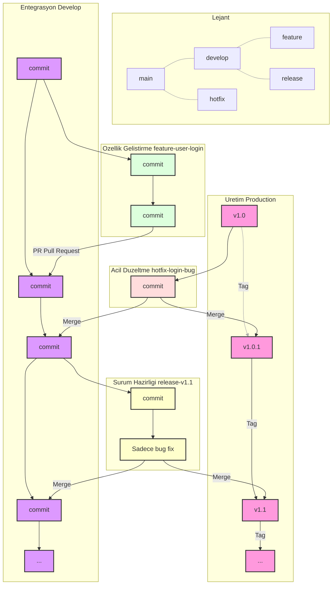

# 🌳 Kapsamlı Branching (Dallanma) Stratejisi Kılavuzu

## 1. Branching (Dallanma) Stratejisi Nedir ve Neden Hayatidir?

**Branching Stratejisi**, bir sürüm kontrol sisteminde (Git gibi) kodun nasıl yönetileceğine dair bir kurallar bütünüdür. Birden fazla geliştiricinin aynı kod tabanı üzerinde *aynı anda*, *birbirini ezmeden* ve *sistemin kararlılığını bozmadan* çalışabilmesini sağlayan bir trafik yönetim sistemidir.

**Neden Hayatidir?**

* **İzolasyon (Isolation):** Her yeni özellik veya hata düzeltmesi, ana kod tabanından izole bir "dalda" (branch) geliştirilir. Bu sayede, yarım kalan veya hatalı bir kod, çalışan ana sistemi (`main`) asla etkilemez.
* **Paralel Geliştirme (Parallel Development):** Eş zamanlı olarak birden fazla `feature` (özellik) ve `hotfix` (acil düzeltme) üzerinde çalışılabilir.
* **Kararlılık (Stability):** Üretim (production) kodunu (`main`) ve bir sonraki sürüm kodunu (`develop`) her zaman kararlı ve çalışır durumda tutar.
* **İzlenebilirlik (Traceability):** Her değişikliğin (commit), bir özellik (feature) veya hata (bug) ile net bir şekilde ilişkilendirilmesini sağlar. Bu, geriye dönük inceleme (auditing) ve hata ayıklama (debugging) için paha biçilmezdir.

Bu kılavuzda, "GitFlow" olarak bilinen, endüstri standardı haline gelmiş ve karmaşık projeler için en uygun olan modeli detaylandıracağız.

## 2. Ana Dallanma (Branch) Akışı (GitFlow Modeli)

Aşağıdaki diyagram, bu stratejideki tüm ana dalları ve aralarındaki ilişkiyi (kod akışını) göstermektedir.

