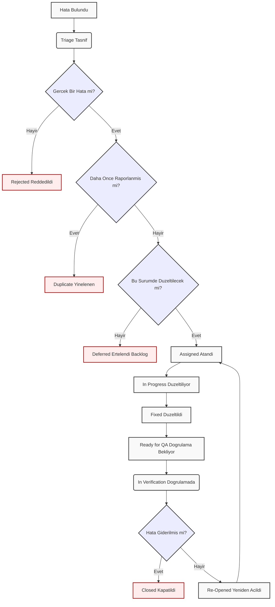

# 🐞 Kapsamlı Hata (Bug) Yönetimi ve Yaşam Döngüsü Kılavuzu

---

## 1. Giriş ve Amaç

Hata (Bug) Yönetimi, bir yazılım ürünündeki kusurların (defect) sistematik olarak bulunması, raporlanması, sınıflandırılması, atanması, düzeltilmesi ve doğrulanması sürecidir.

Bu yaşam döngüsünün amacı **kaosu önlemektir**. Net bir iş akışı olmadan, bulunan hatalar kaybolabilir, öncelikleri anlaşılamaz, kimin düzelteceği belli olmaz ve en önemlisi, düzeltilip düzeltilmediği doğrulanamaz.

Bu kılavuz, bir hatanın doğumundan ölümüne kadar olan standart yaşam döngüsünü (Defect Life Cycle) ve bu süreçteki en iyi uygulamaları tanımlar.

---

## 2. Kapsamlı Hata (Bug) Yaşam Döngüsü

Sağladığınız temel akış, bir hatanın ideal yolculuğunu gösterir. Ancak gerçek dünyada bu akış, hataların reddedilmesi veya yeniden açılması gibi ek adımları da içerir.

Aşağıdaki şema, bu **kapsamlı** ve **gerçekçi** iş akışını göstermektedir:

