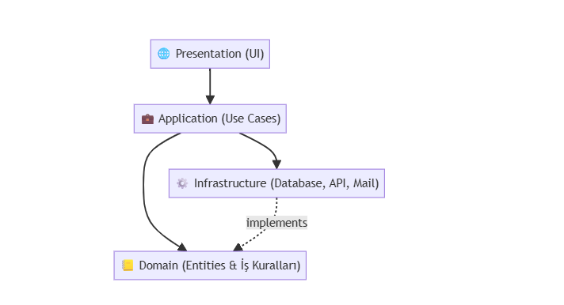

# 🏛️ Kapsamlı Yazılım Tasarım ve Mimari Kılavuzu

Yazılım mimarisi, bir sistemin temel yapısını, bileşenlerini, bu bileşenlerin birbirleriyle ve dış dünyayla olan ilişkilerini ve bu yapıyı yöneten ilke ve yönergeleri tanımlar. Mimarî kararlar, projenin en "pahalı" kararlarıdır; çünkü yanlış bir mimari seçimi, yıllar süren teknik borca, düşük performansa, ölçeklenme sorunlarına ve yüksek bakım maliyetlerine yol açar.

Bu belge, sadece "çalışan kod" yazmayı değil; **"yaşayan, nefes alan ve büyüyen"** sağlam, ölçeklenebilir ve sürdürülebilir sistemler inşa etmeyi amaçlayan tasarım ve mimari süreçlerini detaylandırmaktadır.

---

## 📂 1. Mimarinin Temel Direkleri (Kalite Nitelikleri)

İyi bir mimari, sadece fonksiyonel gereksinimleri (sistemin ne yapacağını) değil, aynı zamanda fonksiyonel olmayan gereksinimleri (sistemin bunu *ne kadar iyi* yapacağını) da karşılamalıdır. Bunlar mimarinin temel hedefleridir.

* **⚡ Performans (Performance):**
    * *Odak:* Sistemin belirli bir yük altında ne kadar hızlı yanıt verdiği (Gecikme - Latency) ve saniyede ne kadar isteği işleyebildiği (Verim - Throughput).
    * *Karar Örnekleri:* Doğru veritabanı indekslemesi, önbelleğe alma (caching) stratejileri (örn: Redis), asenkron işlemler.

* **📈 Ölçeklenebilirlik (Scalability):**
    * *Odak:* Sistemin artan yüke (kullanıcı, veri, işlem) nasıl adapte olduğu.
    * *Karar Örnekleri:* **Dikey Ölçeklenme** (Daha güçlü sunucu - örn: CPU/RAM yükseltme) vs. **Yatay Ölçeklenme** (Daha fazla sunucu ekleme - örn: Load Balancer arkasındaki web sunucuları).

* **🔋 Güvenilirlik & Kullanılabilirlik (Reliability & Availability):**
    * *Odak:* Sistemin ne kadar süre kesintisiz çalıştığı (Uptime) ve hata durumlarında bile (Fault Tolerance) hizmet vermeye devam edebilmesi.
    * *Karar Örnekleri:* Yedeklilik (Redundancy - örn: birden fazla veritabanı sunucusu), hata kurtarma (failover) mekanizmaları, %99.9 (üç-dokuz) gibi "uptime" hedefleri.

* **🧹 Sürdürülebilirlik (Maintainability):**
    * *Odak:* Sistemin ne kadar kolay anlaşılabildiği, değiştirilebildiği, test edilebildiği ve hatadan arındırılabildiği.
    * *Karar Örnekleri:* Temiz kod, modüler tasarım, dokümantasyon, otomatize testler.

* **🔒 Güvenlik (Security):**
    * *Odak:* Sistemin tehditlere, veri ihlallerine ve yetkisiz erişime karşı korunması.
    * *Karar Örnekleri:* Kimlik doğrulama (Authn), yetkilendirme (Authz), veri şifreleme, OWASP Top 10 ilkelerine uyum.

---

## ⚖️ 2. Temel Mimari İlkeler (Principles)

Bu ilkeler, yukarıdaki hedeflere ulaşmak için mimari kararlar alırken bize rehberlik eden "altın kurallardır".

### 🔗 2.1. Serbest Bağlılık (Loose Coupling)

Bir sistemdeki bileşenlerin (modüller, servisler) birbirleri hakkında minimum düzeyde bilgiye sahip olmasıdır.

* **Neden Önemli?** Bir bileşeni değiştirdiğinizde, diğer bileşenlerin bundan etkilenme olasılığı azalır. Bu, bakım ve geliştirmeyi *dramatik* ölçüde kolaylaştırır.
* **Örnek:** Bir `Sipariş Servisi`, bir sipariş oluştuğunda `Fatura Servisi`'nin API'ını doğrudan çağırmak yerine, bir "SiparişOluştu" mesajını bir Mesaj Kuyruğuna (örn: RabbitMQ, Kafka) atar. `Fatura Servisi` bu mesajı dinler ve kendi işini yapar. `Sipariş Servisi`, `Fatura Servisi`'nin varlığından bile haberdar değildir.

### 🎯 2.2. Yüksek Uyum (High Cohesion)

Benzer veya birbiriyle doğrudan ilgili sorumlulukların tek bir modül/bileşen içinde toplanmasıdır.

* **Neden Önemli?** Bir işlevsellikle ilgili tüm kodun (veya mantığın) tek bir yerde olması, kodu bulmayı, anlamayı ve değiştirmeyi kolaylaştırır.
* **Örnek:** Kullanıcı doğrulama, şifre sıfırlama, rol yönetimi gibi tüm güvenlik işlevlerinin `AuthService` (Kimlik Doğrulama Servisi) içinde toplanması. Bu mantığın `ProductService` veya `PaymentService` içine dağıtılmaması gerekir.

### 🧼 2.3. Temiz Katmanlar (Clean Layers / SoC)

Sorumlulukların Ayrılması (Separation of Concerns - SoC) ilkesinin bir uygulamasıdır. Sistem, her biri farklı bir sorumluluğa sahip yatay katmanlara bölünür.

* **Sorumluluklar (User stub'ından):**
    * `UI (Presentation)`: Kullanıcıya bilgiyi gösterir ve kullanıcıdan girdiyi alır (Web sayfası, Mobil uygulama).
    * `Application`: Kullanıcının ne yapmak istediğini (Use Cases) koordine eder. Hangi servisin çağrılacağına, hangi veritabanı işleminin yapılacağına karar verir. İş akışını yönetir.
    * `Domain`: Sistemin kalbidir. İş kurallarını (Business Rules) ve varlıkları (Entities) içerir. Diğer katmanlardan *bağımsızdır*.
    * `Infrastructure`: Dış dünya ile konuşan her şeydir (Veritabanı, Harici API'lar, E-posta gönderme).

* **Görselleştirme:**

    
    
    *(Not: Gerçek Temiz Mimaride (Clean Architecture) bağımlılık yönü her zaman Domain'e doğrudur; Infrastructure, Domain'de tanımlanan arayüzleri (interfaces) uygular.)*

---

## 🗺️ 3. Mimari Desenler ve Stiller (Patterns)

Mimarî ilkeleri hayata geçirmek için kullanılan, kendini kanıtlamış, yaygın çözüm şablonlarıdır.

* ** monolithic (Monolitik Mimari):**
    * *Nedir?* Tüm uygulamanın tek bir dağıtılabilir birim (örn: tek bir `.exe` veya `.war` dosyası) olduğu mimaridir. UI, İş Mantığı, Veritabanı Erişimi hepsi bir aradadır.
    * *Avantajı:* Geliştirmesi hızlıdır, dağıtımı (deploy) basittir, test etmesi kolaydır.
    * *Dezavantajı:* Büyüdükçe karmaşıklaşır (Spaghetti Code), küçük bir değişiklik için bile tüm uygulamanın yeniden deploy edilmesi gerekir, teknoloji değişikliği (örn: farklı dil/veritabanı kullanmak) imkansıza yakındır.

* **🧩 Mikroservis Mimarisi (Microservices):**
    * *Nedir?* Uygulamanın, her biri kendi iş alanından (domain) sorumlu, bağımsız olarak geliştirilen, dağıtılan ve ölçeklenen küçük servislere bölündüğü mimaridir.
    * *Avantajı:* Yüksek ölçeklenebilirlik (sadece `Product` servisini ölçekleyebilirsin), teknoloji özgürlüğü (bir servis Python, diğeri Java olabilir), yüksek sürdürülebilirlik, hata izolasyonu (bir servis çökerse diğeri etkilenmez).
    * *Dezavantajı:* Çok yüksek operasyonel karmaşıklık (dağıtık sistem yönetimi, servis keşfi, loglama), ağ gecikmeleri, veri tutarlılığını sağlamak zordur (SAGA, Eventual Consistency).

* **▶️ Olay Güdümlü Mimari (Event-Driven Architecture - EDA):**
    * *Nedir?* Servislerin birbirleriyle doğrudan konuşmak yerine, "olaylar" (events) üzerinden (genellikle bir mesaj aracısı - Message Broker - ile) iletişim kurduğu mimaridir. (Bkz: Gevşek Bağlılık).
    * *Avantajı:* Mükemmel gevşek bağlılık, yüksek ölçeklenebilirlik, sistemin yeni işlevlere kolayca adapte olabilmesi.
    * *Dezavantajı:* İş akışını takip etmek ve hata ayıklamak zordur ("Nereden geldi bu mesaj?"), veri tutarlılığını (eventual consistency) yönetmek gerekir.

---

## ✍️ 4. Tasarım Çıktıları ve Dokümantasyon

Mimarî kararların soyut kalmaması, tüm ekibin anlayabileceği somut çıktılara dönüşmesi gerekir.

### 🗺️ 4.1. Yüksek Seviye Mimari (C4 Modeli)

Mimariyi farklı yakınlaştırma seviyelerinde (zoom level) göstermenin harika bir yoludur. "Google Maps" gibi düşünebilirsiniz: Önce dünyayı, sonra ülkeyi, sonra şehri, sonra sokağı görürsünüz.

* **C1: Sistem Bağlamı (Context):** En üst seviye. Sisteminizi bir "kara kutu" olarak gösterir. Dışındaki kullanıcılar ve diğer sistemlerle ilişkisini gösterir.
* **C2: Konteyner (Container):** Kara kutunun içine girer. Sisteminizi oluşturan ana parçaları (konteynerleri) gösterir (Örn: Web UI, Backend API, Veritabanı, Mobil Uygulama).
* **C3: Bileşen (Component):** Bir konteynerin içine girer. O konteyneri oluşturan ana bileşenleri/modülleri gösterir (Örn: Backend API içindeki `AuthController`, `ProductService`, `PaymentGateway`).
* **C4: Kod (Code):** (Genellikle opsiyonel) Bir bileşenin içindeki sınıfları (Class Diagram) gösterir.

=== "C1: Sistem Bağlamı (Context)"
    ```mermaid
    graph TD
      User((Kullanıcı)) --> App[Uygulama]
      App --> DB[(Veritabanı)]
      App --> Ext[Harici Servisler]
    ```
=== "C2: Konteyner (Container)"
    ```mermaid
    graph TD
      Web[Web UI] --> API[Backend API]
      API --> DB[(PostgreSQL)]
      API --> Cache[(Redis)]
    ```
=== "C3: Bileşen (Component)"
    ```mermaid
    graph TD
        subgraph "Container: Backend API"
            direction LR
            A[Auth Controller] --> B[Auth Service]
            C[Product Controller] --> D[Product Service]
            B --> DB[(Database)]
            D --> DB[(Database)]
            D --> Cache[(Redis)]
        end
    ```

### 🗃️ 4.2. Veri Modeli (ERD - Entity-Relationship Diagram)

Sisteminizin "isimlerini" (varlıklarını) ve aralarındaki "fiilleri" (ilişkileri) tanımlar. Veritabanı şemasının temelini oluşturur.

* **Varlık (Entity):** Saklanması gereken ana nesne (Örn: `Müşteri`, `Ürün`, `Sipariş`).
* **Öznitelik (Attribute):** Varlığın bir özelliği (Örn: `Müşteri`'nin `Adı`, `Epostası`).
* **İlişki (Relationship):** Varlıkların birbirleriyle nasıl bağlantılı olduğu (Örn: Bir `Müşteri` *birden çok* `Sipariş` verebilir - 1-N İlişkisi).

* **Örnek ERD (Mermaid):**
    ```mermaid
    erDiagram
        CUSTOMER ||--o{ ORDER : "sipariş verir"
        ORDER ||--|{ LINE-ITEM : "içerir"
        PRODUCT }|--|{ LINE-ITEM : "ürünüdür"

        CUSTOMER {
            int id PK
            string name
            string email
        }
        ORDER {
            int id PK
            int customer_id FK
            datetime created_at
        }
        PRODUCT {
            int id PK
            string name
            float price
        }
        LINE-ITEM {
            int id PK
            int order_id FK
            int product_id FK
            int quantity
        }
    ```

### 📡 4.3. API Tasarımı (OpenAPI/Swagger)

Servisler arası veya UI-Backend arası iletişimin "sözleşmesidir". Bu sözleşme, tarafların birbirini beklemeden paralel olarak geliştirme yapabilmesini sağlar.

* **OpenAPI (eski adıyla Swagger):** RESTful API'ları tanımlamak için kullanılan endüstri standardı bir spesifikasyondur.
* **Neleri Tanımlar?**
    * Mevcut tüm endpoint'ler (örn: `/products/{id}`).
    * Her endpoint'in hangi HTTP metodunu kullandığı (GET, POST, PUT, DELETE).
    * Gerekli parametreler (Path, Query, Header, Body).
    * İstek ve yanıt gövdelerinin (body) veri modelleri (schema).
    * Olası hata kodları (200, 201, 400, 404, 500).

* **Örnek (YAML):**
    ```yaml
    openapi: 3.0.0
    info:
      title: Ürün Servisi API
      version: 1.0.0
    paths:
      /products/{id}:
        get:
          summary: ID ile bir ürün getirir
          parameters:
            - name: id
              in: path
              required: true
              schema:
                type: integer
          responses:
            '200':
              description: Başarılı ürün yanıtı
              content:
                application/json:
                  schema:
                    $ref: '#/components/schemas/Product'
    components:
      schemas:
        Product:
          type: object
          properties:
            id:
              type: integer
            name:
              type: string
            price:
              type: number
    ```

### 📊 4.4. Performans & Güvenlik Kararları (SLx)

Mimarinin fonksiyonel olmayan hedeflerini somut, ölçülebilir ve izlenebilir hale getirmek için kullanılır.

* **SLI (Service Level Indicator - Hizmet Seviyesi Göstergesi):**
    * *Nedir?* Bir hizmetin kalitesini ölçen ham metrik.
    * *Örnek:* "API yanıt süresi (latency)", "Sistem hata oranı", "Uptime".

* **SLO (Service Level Objective - Hizmet Seviyesi Hedefi):**
    * *Nedir?* SLI için belirlenen *iç* hedef. Ekibin ulaşmaya çalıştığı başarı eşiğidir.
    * *Örnek:* "İsteklerin %99.9'u 200ms altında yanıtlanmalıdır.", "Hata oranı %0.1'in altında olmalıdır.", "Aylık uptime %99.95 olmalıdır."

* **SLA (Service Level Agreement - Hizmet Seviyesi Anlaşması):**
    * *Nedir?* SLO'lara dayalı, müşteri ile yapılan *resmi sözleşmedir*. Genellikle finansal bir yaptırımı (ceza veya iade) içerir.
    * *Örnek:* "Aylık uptime %99.9'un altına düşerse, o ayki fatura bedelinin %10'u iade edilir."

---

## ✅ 5. Bitti Tanımı (Definition of Done - DoD)

Tasarım ve mimari aşamasının "bitti" kabul edilmesi için gereken kontrol listesidir. (User stub'ından)

* [ ] Yüksek seviye mimari diyagramları (C1/C2/C3) çizildi ve versiyonlandı.
* [ ] Kritik iş akışları için Veri Modeli (ERD) oluşturuldu.
* [ ] Harici ve (gerekliyse) dahili iletişim için API sözleşmeleri (OpenAPI) yazıldı.
* [ ] Güvenlik (Authn/Authz) planı netleştirildi (Örn: JWT, OAuth 2.0).
* [ ] Performans ve ölçeklenme hedefleri (SLO'lar) tanımlandı (Örn: 1000 eşzamanlı kullanıcı, <500ms yanıt süresi).
* [ ] Kritik mimari kararlar (ADR - Architecture Decision Records) yazılı hale getirildi ("Neden Mikroservis seçtik?", "Neden Kafka yerine RabbitMQ kullandık?").