# 🔄 Yazılım Geliştirme Yaşam Döngüsü (SDLC) - Kapsamlı Genel Bakış

Yazılım Geliştirme Yaşam Döngüsü (SDLC), bir yazılım ürününün fikir aşamasından başlayarak, kullanımdan kaldırılmasına (emekliliğine) kadar olan tüm süreçlerini planlamak, yürütmek ve yönetmek için kullanılan bir çerçevedir.

Bu kılavuz, bu yaşam döngüsünün adımlarını ve popüler uygulama modellerini detaylandırmaktadır.

## 1. Uçtan Uca Temel Akış

Aşağıdaki akış, bir yazılım projesindeki temel ve idealize edilmiş adımları özetler. Her adım, bir sonrakini besler ve son adım (Bakım), döngünün tekrar başına (yeni gereksinimler) girdi sağlar.

```mermaid
flowchart LR
   subgraph SDLC Dongusu
       A[1. Planlama ve Gereksinim Analizi] --> B[2. Tasarım ve Mimari]
       B --> C[3. Geliştirme Implementation]
       C --> D[4. Test ve Dogrulama]
       D --> E[5. Yayın ve Dağıtım Deploy]
       E --> F[6. Bakım ve Operasyon]
   end
   F -.->|Geri Bildirim & Yeni Fikirler| A
```

