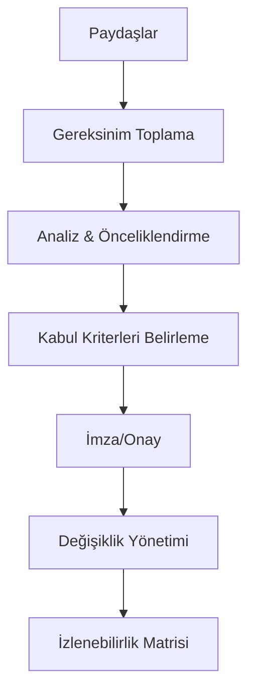

# 🎯 Kapsamlı Yazılım Gereksinimleri Analizi Kılavuzu

Yazılım gereksinimi, bir sistemin bir iş hedefini veya paydaş beklentisini karşılamak için yerine getirmesi gereken bir koşul, özellik veya kısıtlamadır. Projenin "Ne" yapılacağını tanımlayan ve teknik ekip ile iş birimleri arasında imzalanan bir "sözleşmedir".

Projelerdeki başarısızlıkların, bütçe aşımlarının ve gecikmelerin kök nedeni neredeyse her zaman eksik, yanlış veya kötü yönetilen gereksinimlerdir. Bu belge, gereksinimleri profesyonel bir düzeyde nasıl ele alacağınızı detaylandırmaktadır.

## 📂 1. Gereksinim Türleri ve Hiyerarşisi

Gereksinimler, soyut bir "iş hedefinden" somut bir "kod satırına" doğru bir hiyerarşi izler.

### 💼 1.1. İş (Business) Gereksinimleri

Projenin "Neden" yapıldığını tanımlayan üst düzey hedeflerdir. Teknik detay içermezler, sadece işin stratejik amacını belirtirler.

* **Odak:** Organizasyonel hedef, ROI (Yatırım Geri Dönüşü), pazar payı.
* **Sorumlu:** Proje Sponsoru, Üst Yönetim.
* **Kritik Soru:** "Bu projeyi neden yapıyoruz?"
* **Örnekler:**
    * "Müşteri destek operasyonlarının maliyetini ilk yıl %20 azaltmak."
    * "Yeni B2B portalı üzerinden pazar payımızı %5 arttırmak."
    * "Manuel veri giriş süreçlerini otomatikleştirerek ayda 40 adam/saat tasarruf sağlamak."

### 🧑‍💻 1.2. Kullanıcı (veya Paydaş) Gereksinimleri

İş hedeflerine ulaşmak için kullanıcıların sistemle *neler yapabilmesi gerektiğini* tanımlar.

* **Odak:** Kullanıcının görevleri, hedefleri ve sistemle etkilekşimi.
* **Sorumlu:** Ürün Sahibi (Product Owner), İş Analisti, UX Tasarımcısı.
* **Kritik Soru:** "Kullanıcıların bu sistemle hangi hedeflerine ulaşması gerekiyor?"
* **Format:** Genellikle Kullanıcı Hikayeleri (User Stories) veya Kullanım Senaryoları (Use Cases) olarak ifade edilir.
* **Örnek:**
    * "Bir depo sorumlusu olarak, stok seviyesi kritik düzeyin altına düşen ürünleri ana sayfamda görebilmeliyim ki, zamanında sipariş verebileyim."

### 🖥️ 1.3. Çözüm Gereksinimleri (Sistem Gereksinimleri)

Kullanıcı gereksinimlerini karşılamak için sistemin *nasıl* davranması gerektiğini detaylandıran teknik katmandır. Bu, geliştiricinin ve test uzmanının doğrudan kullanacağı belgelerdir. İkiye ayrılır:

#### ✅ 1.3.1. Fonksiyonel Gereksinimler

Sistemin *ne yapması gerektiğini* (davranışlarını, özelliklerini) tanımlar.

* **Odak:** Özellikler, fonksiyonlar, veri işleme, "fiiller".
* **Kritik Detaylar:**
    * **İş Kuralları (Business Rules):** "Eğer sepet tutarı 500 TL üzerindeyse ve müşterinin 'Gold' statüsü varsa, %10 indirim otomatik uygulanmalıdır."
    * **Veri İşleme:** "Kullanıcı 'Kaydet' butonuna bastığında, form verileri 'Products' tablosunda doğrulanmalı (validation) ve kaydedilmelidir."
    * **Arayüz Etkileşimleri:** "Ana sayfadaki 'Ara' kutusuna en az 3 harf girildiğinde, otomatik tamamlama önerileri 500ms içinde gösterilmelidir."
    * **Yetkilendirme ve İzinler:** "'Admin' rolü tüm kayıtları silebilir, 'Editor' rolü sadece kendi eklediği kayıtları güncelleyebilir, silemez."
    * **Raporlama:** "Sistem, seçilen tarih aralığı için günlük satış verilerini içeren bir CSV ve PDF çıktısı üretebilmelidir."

#### ⚙️ 1.3.2. Fonksiyonel Olmayan Gereksinimler (NFRs - Non-Functional Requirements)

Sistemin bir işlevi *ne kadar iyi* yapması gerektiğini tanımlayan kalite özellikleridir. Projelerin en çok göz ardı edilen ve en çok başarısızlığa uğratan kısmıdır.

* **⚡ Performans & Ölçeklenebilirlik:**
    * *Detay:* Yanıt süresi, saniyedeki işlem sayısı (throughput), gecikme (latency), eşzamanlı kullanıcı yükü.
    * *Örnek:* "Ürün listeleme sayfası, 1 milyon ürün kaydı olsa dahi, 100 eşzamanlı kullanıcı yükü altında 2 saniyenin altında yüklenmelidir."

* **🔒 Güvenlik (Security):**
    * *Detay:* Kimlik doğrulama (OAuth 2.0, JWT), yetkilendirme, veri şifrelemesi (Data Encryption at Rest & in Transit), saldırı önleme (OWASP Top 10 uyumluluğu - SQL Injection, XSS korumaları).
    * *Örnek:* "Tüm kullanıcı parolaları, 'bcrypt' algoritması (salt ile) kullanılarak veritabanında 'hash'lenerek saklanmalıdır."
    * *Örnek:* "Kullanıcı oturumları (session) 30 dakika işlem yapılmadığında sunucu tarafında otomatik olarak sonlandırılmalıdır."

* **😊 Kullanılabilirlik (Usability) & UX:**
    * *Detay:* Sistemin ne kadar kolay öğrenilebildiği, verimliliği, hata toleransı ve kullanıcı memnuniyeti.
    * *Örnek:* "Daha önce sistemi hiç kullanmamış bir kullanıcı, herhangi bir eğitim almadan 3 dakika içinde bir ürünü sepete ekleyip satın alma işlemini tamamlayabilmelidir (Task Completion Rate)."

* **🔋 Güvenilirlik (Reliability) & Kullanılabilirlik (Availability):**
    * *Detay:* Sistemin ne kadar süre kesintisiz çalıştığı (uptime), hatalardan ne kadar hızlı kurtulabildiği (recovery), MTBF (Hatalar Arası Ortalama Süre).
    * *Örnek:* "Sistemin çalışma süresi (uptime) yıllık %99.9 olmalıdır (Yılda en fazla 8.76 saat planlı/plansız kesinti kabul edilebilir)."

* **📱💻 Uyumluluk (Compatibility):**
    * *Detay:* Hangi tarayıcılarda, işletim sistemlerinde, cihazlarda (mobil, tablet) veya diğer sistemlerle (API entegrasyonları) çalışacağı.
    * *Örnek:* "Web uygulaması, Chrome, Firefox ve Safari'nin en son iki ana sürümünde tam işlevsel olarak (pixel-perfect değil) çalışmalıdır."

* **♿ Erişilebilirlik (Accessibility - a11y):**
    * *Detay:* Sistemin engelli bireyler (görme, işitme, motor beceri engelliler) tarafından kullanılabilmesi.
    * *Örnek:* "Tüm sistem arayüzleri, WCAG 2.1 AA seviyesine uyumlu olmalı ve ekran okuyucularla (Örn: NVDA, JAWS) tam uyumlu çalışmalıdır."

* **🧹 Sürdürülebilirlik (Maintainability):**
    * *Detay:* Kodun ne kadar kolay anlaşılabildiği, değiştirilebildiği ve bakıma alınabildiği.
    * *Örnek:* "Tüm API endpoint'leri için OpenAPI (Swagger) dokümantasyonu otomatik olarak oluşturulmalıdır."
    * *Örnek:* "Kritik iş mantığı modülleri için kod kapsamı (code coverage) %85'in üzerinde olmalıdır."

* **🏛️ Yasal ve Mevzuat Uyumluluğu (Regulatory Compliance):**
    * *Detay:* Sektöre özel (Sağlık için HIPAA, Finans için PCI-DSS) veya genele yönelik (KVKK, GDPR) yasal zorunluklar.
    * *Örnek:* "Kullanıcıların kişisel verileri (KVKK kapsamında) Türkiye'deki sunucularda barındırılmalı ve açık rıza olmadan üçüncü partilerle paylaşılmamalıdır."

### ⛓️ 1.4. Kısıtlamalar (Constraints)

Ekibin tasarım ve uygulama seçeneklerini sınırlayan, genellikle dışarıdan gelen (veya teknik mimari gereği) değiştirilemez kararlardır.

* *Örnek:* "Proje bütçesi 500.000 TL'yi aşamaz."
* *Örnek:* "Sistem, mevcut altyapıdaki Oracle 11g veritabanını kullanmak zorundadır."
* *Örnek:* "Tüm geliştirmeler, şirketin kurumsal kimliğine uygun olarak mevcut React bileşen kütüphanesi kullanılarak yapılmalıdır."

---

## 🛠️ 2. Gereksinim Toplama ve Modelleme Teknikleri

Gereksinimler "toplanmaz", "ortaya çıkarılır" (elicitation). Çünkü paydaşlar genellikle ne istediklerini tam olarak bilmezler; neye *ihtiyaç* duyduklarını bilirler.

### 🕵️ 2.1. Ortaya Çıkarma Teknikleri

* **Paydaş Görüşmeleri (Stakeholder Interviews):** Kilit paydaşlarla (son kullanıcı, yönetici, teknik uzman, hukuk) birebir veya grup halinde yapılan, açık uçlu sorularla (5 Neden?, Senaryo bazlı) derinlemesine analiz sağlayan görüşmeler.
* **Çalıştaylar (Workshops / JAD Sessions):** Tüm kilit paydaşları bir odaya toplayıp (fiziksel veya sanal) gereksinimler üzerinde beyin fırtınası yapmak ve anında uzlaşma sağlamak.
* **Gözlem (Observation / Shadowing):** Kullanıcının mevcut işini nasıl yaptığını fiilen izlemek. Genellikle kullanıcının "söylediği" ile "yaptığı" farklıdır ve bu farklar otomasyon fırsatlarını doğurur.
* **Prototipleme (Prototyping):** "Kullanıcıya ne istediğini sorma, ona göster ve ne istemediğini söylemesine izin ver." Hızlıca tıklanabilir bir arayüz (Wireframe/Mockup) hazırlayıp geri bildirim almak, en etkili tekniktir.
* **Anketler (Surveys):** Çok geniş bir kullanıcı kitlesinden (örneğin 5000 bayi) nicel veri toplamak için kullanılır.

### ✍️ 2.2. Dokümantasyon ve Modelleme Teknikleri

Ortaya çıkarılan dağınık bilgilerin yapılandırılması ve herkesin anlayacağı bir dile dökülmesi gerekir.

* **Kullanıcı Hikayeleri (User Stories):** (Agile/Çevik yaklaşımın temeli)
    * **Bu bir Şablondur (Template):** `<...>` işaretleri, "burayı doldur" anlamına gelen yer tutuculardır.
    * *Şablon:* **`"Bir <Kullanıcı Rolü> olarak, <bir hedef/istek> istiyorum, çünkü <elde edeceğim değer>."`**
    * *Örnek:* "Bir **e-ticaret müşterisi** olarak, sepetimdeki ürünleri **'daha sonra al' listesine kaydedebilmeliyim**, çünkü **şu an satın almaya hazır olmayabilirim**."
* **Kabul Kriterleri (Acceptance Criteria - AC):** Bir kullanıcı hikayesinin "bitti" (Done) olarak kabul edilmesi için gereken, test edilebilir şartlardır.
    * *Format (Given-When-Then / BDD):*
        * **Given** (Durum): Kullanıcı sepetinde 3 ürün varken.
        * **When** (Eylem): Kullanıcı 'Daha sonra al' butonuna bastığında.
        * **Then** (Sonuç): Ürün sepetten çıkarılmalı VE 'Daha Sonra Al' listesine eklenmelidir.
* **Kullanım Senaryoları (Use Cases) ve Diyagramları:** (Daha geleneksel ve detaylı)
    * Bir aktör (kullanıcı veya başka bir sistem) ile sistem arasındaki etkileşimi adım adım (Ana Başarı Akışı, Alternatif Akışlar, Hata Akışları) metinsel olarak tanımlar.
    * Use-Case Diyagramı (UML), bu etkileşimlerin kuşbakışı görsel özetidir.
* **Wireframe ve Prototip (Görselleştirme):**
    * **Wireframe (Tel Çerçeve):** Düşük sadakatli (low-fidelity) taslaktır. Sadece arayüz elemanlarının (buton, kutu, metin) nerede duracağını gösterir. Amacı *işlevselliği* tartışmaktır.
    * **Mockup / Prototip:** Yüksek sadakatli (high-fidelity) tasarımdır. Renkler, ikonlar, fontlar içerir ve bitmiş ürüne çok benzer. Bazen tıklanabilir (interaktif prototip) olur. Amacı *kullanılabilirliği* ve *görsel tasarımı* onaylatmaktır.
* **İş Akış Diyagramları (Business Process Models - BPMN):**
    * Bir iş sürecinin başından sonuna kadar olan adımlarını, kararlarını (evet/hayır), döngülerini ve sorumlu departmanları (swimlane) gösterir.

---

## 🔁 3. Gereksinim Yönetimi Süreci

Aşağıdaki diyagram süreci özetler:

